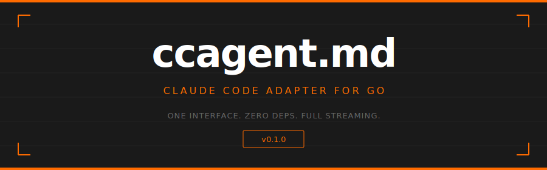

<p align="center">
  
</p>

<p align="center">
  <code>go get github.com/readmedotmd/ccagent.md</code>
</p>

---

## What is this?

A Go adapter that wraps **Claude Code CLI** behind the standard **[agent.adapter.md](https://github.com/readmedotmd/agent.adapter.md)** interface. Subprocess-based, streaming JSON, **zero external dependencies**.

```go
type Adapter interface {
    Start(ctx context.Context, cfg AdapterConfig) error
    Send(ctx context.Context, msg Message, opts ...SendOption) error
    Cancel() error
    Receive() <-chan StreamEvent
    Stop() error
    Status() AdapterStatus
    Capabilities() AdapterCapabilities
    Health(ctx context.Context) error
}
```

---

## Features

<table>
  <tr>
    <td width="200"><strong>Streaming</strong></td>
    <td>Token-by-token events via <code>&lt;-chan StreamEvent</code></td>
  </tr>
  <tr>
    <td><strong>Tool Use</strong></td>
    <td>Full tool call lifecycle — ID correlation, input, output, status</td>
  </tr>
  <tr>
    <td><strong>Extended Thinking</strong></td>
    <td>Thinking blocks streamed as <code>EventThinking</code> events</td>
  </tr>
  <tr>
    <td><strong>Images</strong></td>
    <td>Multimodal messages with base64-encoded image content blocks</td>
  </tr>
  <tr>
    <td><strong>MCP Servers</strong></td>
    <td>Attach stdio MCP servers via config — temp file managed automatically</td>
  </tr>
  <tr>
    <td><strong>Sub-agents</strong></td>
    <td>Define and delegate to named sub-agents with their own tools and models</td>
  </tr>
  <tr>
    <td><strong>Sessions</strong></td>
    <td>Resume, continue, and track sessions via <code>SessionProvider</code></td>
  </tr>
  <tr>
    <td><strong>Context Compaction</strong></td>
    <td>Automatic summarization at 80% context usage — sessions stay fast</td>
  </tr>
  <tr>
    <td><strong>Cancellation</strong></td>
    <td>Cancel in-flight runs, clear the queue, adapter stays alive</td>
  </tr>
  <tr>
    <td><strong>Cost Tracking</strong></td>
    <td><code>EventCostUpdate</code> with token counts and USD estimate</td>
  </tr>
  <tr>
    <td><strong>Zero Deps</strong></td>
    <td>Only the Go standard library — the internal SDK is fully inlined</td>
  </tr>
</table>

---

## Quick Start

```go
package main

import (
    "context"
    "fmt"

    claude "github.com/readmedotmd/ccagent.md"
    ai "github.com/readmedotmd/ccagent.md/adapter"
)

func main() {
    ctx := context.Background()
    adapter := claude.NewClaudeAdapter()

    err := adapter.Start(ctx, ai.AdapterConfig{
        Name:           "my-agent",
        WorkDir:        ".",
        PermissionMode: ai.PermissionAcceptAll,
    })
    if err != nil {
        panic(err)
    }
    defer adapter.Stop()

    // Send a message
    adapter.Send(ctx, ai.Message{
        Role:    ai.RoleUser,
        Content: ai.TextContent("What files are in this directory?"),
    })

    // Stream the response
    for ev := range adapter.Receive() {
        switch ev.Type {
        case ai.EventToken:
            fmt.Print(ev.Token)
        case ai.EventToolUse:
            fmt.Printf("\n[tool: %s]\n", ev.ToolName)
        case ai.EventThinking:
            fmt.Printf("\n[thinking: %s]\n", ev.Thinking)
        case ai.EventDone:
            fmt.Println()
            return
        case ai.EventError:
            fmt.Printf("\nerror: %v\n", ev.Error)
            return
        }
    }
}
```

> [Full usage guide &rarr;](./docs/getting-started.md)

---

## Streaming Events

Every response is delivered as a stream of typed events:

| Event | Description |
|---|---|
| `EventToken` | Text token — concatenate for full response |
| `EventThinking` | Extended thinking content |
| `EventToolUse` | Tool invocation started |
| `EventToolResult` | Tool completed with output |
| `EventPermissionRequest` | Agent needs user approval |
| `EventPermissionResult` | Approval decision (for logging) |
| `EventFileChange` | File created, edited, deleted, or renamed |
| `EventSubAgent` | Sub-agent started, completed, or failed |
| `EventProgress` | Long-running operation progress (0–1) |
| `EventCostUpdate` | Token usage and USD cost |
| `EventDone` | Turn complete — includes full `Message` |
| `EventError` | Something went wrong |

> [Event reference &rarr;](./docs/events.md)

---

## Configuration

```go
adapter.Start(ctx, ai.AdapterConfig{
    Name:               "my-agent",
    WorkDir:            "/path/to/project",
    SystemPrompt:       "You are a Go expert.",
    AppendSystemPrompt: "Always run tests after changes.",
    Model:              "claude-sonnet-4-20250514",
    MaxThinkingTokens:  16000,
    PermissionMode:     ai.PermissionPlan,
    ContextWindow:      200000,
    AllowedTools:       []string{"Read", "Write", "Bash"},
    DisallowedTools:    []string{"WebSearch"},
    MCPServers: map[string]ai.MCPServerConfig{
        "filesystem": {
            Command: "npx",
            Args:    []string{"-y", "@anthropic-ai/mcp-filesystem"},
        },
    },
    Agents: map[string]ai.AgentDef{
        "researcher": {
            Description: "Searches codebase for patterns",
            Prompt:      "Find all usages of the given function",
            Tools:       []string{"Grep", "Glob", "Read"},
            Model:       "haiku",
        },
    },
})
```

> [Configuration reference &rarr;](./docs/configuration.md)

---

## Architecture

```
┌─────────────────────────────────────────────────┐
│                  Your Application                │
│                                                  │
│   adapter.Start()  adapter.Send()  adapter.Receive()
└──────────┬──────────────┬──────────────┬─────────┘
           │              │              │
    ┌──────▼──────────────▼──────────────▼─────────┐
    │              ClaudeAdapter                    │
    │   queue ─── runLoop ─── event emission        │
    │   session tracking ─── context compaction     │
    └──────────────────┬───────────────────────────┘
                       │
    ┌──────────────────▼───────────────────────────┐
    │           internal/claudecode                 │
    │   Client ─── Transport ─── Parser             │
    │   stdin/stdout JSON streaming                 │
    └──────────────────┬───────────────────────────┘
                       │
    ┌──────────────────▼───────────────────────────┐
    │            Claude Code CLI                    │
    │   claude --output-format stream-json          │
    └──────────────────────────────────────────────┘
```

> [Architecture deep dive &rarr;](./docs/architecture.md)

---

## Testing

```bash
go test ./...
```

97 tests across three packages — adapter types, internal SDK (parser, transport, client, options, CLI, errors), and main adapter logic.

> [Testing guide &rarr;](./docs/testing.md)

---

## Prerequisites

- **Go 1.23.6+**
- **Claude Code CLI** installed (`npm install -g @anthropic-ai/claude-code`)
- A valid **Anthropic API key** configured for the CLI

---

<p align="center">
  <sub>Built by <a href="https://github.com/readmedotmd">readmedotmd</a></sub>
</p>
